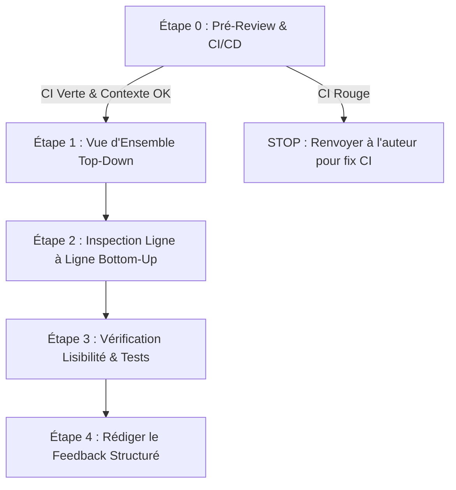

# 📋 Fiche Méthode : Réussir sa Code Review (Étape par Étape)

> **Objectif** : Améliorer la qualité globale du code (*Code Health*) de façon déterministe, bienveillante et rapide, sans perdre de temps sur des détails cosmétiques.

---

## 🎯 Les 3 Principes Fondamentaux (Google Engineering Practices)

1. **Amélioration > Perfection** : Le code n'a pas besoin d'être "parfait", il doit laisser le codebase dans un meilleur état qu'avant. Ne bloque pas une Pull Request (PR) pour une simple préférence personnelle.
2. **Faits Techniques > Opinions** : Fonde tes remarques sur des arguments techniques factuels (performance, sécurité, lisibilité, maintenabilité).
3. **Automatismes d'Abord** : Ne fais pas manuellement ce qu'un outil peut faire (style, typage, syntaxe). Si la CI/CD est rouge, la review s'arrête là.

---

## 🚀 Le Workflow en 5 Étapes

---

### Étape 0 : Pré-Review & Contextualisation (Le "Pourquoi")

Avant de regarder le moindre diff :
- [ ] **Lire le ticket / la spec** : Quel est le problème métier résolu ? Quelle est l'intention de la PR ?
- [ ] **Vérifier les automatismes** : Est-ce que les linters (`ruff`, `flake8`), les checkers de types (`mypy`) et les tests unitaires automatisés passent ?
  > ⚠️ *Règle d'or : Si la CI/CD est au rouge, ne perds pas ton temps à reviewer le code. Demande à l'auteur de corriger la CI d'abord.*

---

### Étape 1 : Vue d'Ensemble & Architecture (Passage Top-Down)

Survole la liste des fichiers modifiés (`git diff --stat` ou l'onglet Files Changed) pour comprendre la structure globale :
- [ ] **Périmètre (Scope)** : La PR ne traite-t-elle que le sujet prévu ? (Détecter le *Scope Creep* ou les refactorings cachés).
- [ ] **Responsabilité Unique (SRP)** : Les responsabilités sont-elles bien découpées ou y a-t-il création d'une *God Class* / fonction monolithe ?
- [ ] **Injection de Dépendances** : Les dépendances externes (Bases de données, clients d'API LLM) sont-elles injectées ou instanciées en dur ?
- [ ] **Couplage & Modularité** : La logique métier est-elle séparée de la couche d'E/S (FastAPI, CLI, etc.) ?

---

### Étape 2 : Inspection Ligne à Ligne (Passage Bottom-Up - Chasse aux Bugs)

Examine le code en détail pour traquer les bugs critiques et les pièges classiques.

#### A. Bugs Python & Concurrence Asynchrone (`asyncio`)
- [ ] **`await` manquant** : La fonction async est-elle bien appelée avec `await res()` ? (Sinon `res` contient un objet coroutine non exécuté).
- [ ] **Event Loop bloquée** : Y a-t-il du code bloquant (`time.sleep()`, `requests.get()`, calculs CPU lourds) au milieu d'un flux `async` ?
- [ ] **`asyncio.run()` interdit en runtime** : Est-ce qu'un `asyncio.run()` est appelé dans une Event Loop déjà active (ex: endpoint FastAPI) ?

#### B. Gestion des Ressources & Effets de Bord
- [ ] **Context Managers** : Les fichiers, sockets ou connexions BDD sont-ils gérés avec `with` / `async with` ?
- [ ] **Arguments par défaut mutables** : Cherche les `def fn(items=[])` ou `def fn(config={})`. Remplacer par `Optional[List] = None`.
- [ ] **Exceptions ravalées (Swallowed exceptions)** : Traque les `try: ... except Exception: pass` silencieux qui masquent les pannes.

#### C. Robustesse & Contrats de Données
- [ ] **Validation aux frontières** : Les objets dict ou JSON externes sont-ils validés (ex: modèles Pydantic, checks `None`) avant accès ?
- [ ] **Statuts HTTP / API** : Les erreurs renvoient-elles de vrais codes HTTP (400, 404, 500) au lieu d'un `200 OK` avec `{"error": ...}` ?
- [ ] **Requêtes N+1 / Perf** : Les appels API ou requêtes SQL sont-ils faits dans une boucle `for` au lieu d'être requêtés par batch ?

#### D. Pièges Spécifiques Workflows AI & LLM (si applicable)
- [ ] **Historique de conversation** : L'historique des messages est-il fenêtré (Sliding Window) pour éviter la saturation du contexte ?
- [ ] **Preservation du System Prompt** : Le fenêtrage conserve-t-il bien le message système à l'index `0` ?
- [ ] **Isolation Multi-Tenant** : Le `tenant_id` ou `user_id` est-il filtré pour éviter les fuites de données inter-utilisateurs ?
- [ ] **Validation des appels d'outils (Tools)** : Les arguments renvoyés par un LLM sont-ils validés via Pydantic avant exécution ?

---

### Étape 3 : Lisibilité, Maintainabilité & Tests

- [ ] **Nommage expressif** : Les noms de variables/fonctions décrivent-ils clairement leur rôle ? (`fetch_active_users()` au lieu de `get_data()`).
- [ ] **Complexité inutile** : Le code peut-il être simplifié ? Y a-t-il de la sur-ingénierie (*Over-engineering*) ?
- [ ] **Code mort & Debug** : Y a-t-il des `print()` oubliés, du code commenté ou des imports inutilisés ?
- [ ] **Tests unitaires** :
  - Les cas nominaux et les cas aux limites (*edge cases*, erreurs, `None`) sont-ils testés ?
  - Les tests sont-ils déterministes (Mocks sur les API externes, pas de requêtes réseau réelles) ?

---

### Étape 4 : Rediger le Feedback (La Forme & les Conventions)

Un feedback efficace utilise la **Convention des Préfixes** pour expliciter la sévérité de chaque remarque :

| Préfixe | Signification | Exigences |
| :--- | :--- | :--- |
| `[BLOCKER]` | Bug critique, faille de sécurité, crash en prod | **Bloquant** : Doit être corrigé avant de merge |
| `[MAJOR]` | Problème d'architecture, fuite de mémoire, perf | **Bloquant** : Nécessite une modification ou justification |
| `[MINOR]` | Lisibilité, refactoring local, manque de typage | **Non-bloquant** : Recommandé mais negotiable |
| `[NIT]` | Detail cosmétique, préférence de style | **Non-bloquant** : L'auteur est libre d'appliquer ou pas |
| `[QUESTION]`| Demande d'explication ou de clarification | **Informatif** : Nécessite juste une réponse |

#### Exemple de bon commentaire :
> `[MAJOR]` : L'appel `requests.post()` dans cet endpoint `async` va bloquer l'Event Loop sous charge.
> **Pourquoi** : Cela dégrade le p99 de tous les autres clients connectés.
> **Suggestion** : Utiliser `await client.post()` avec `httpx.AsyncClient`.

---

## 🚫 Les Pièges à Éviter (Anti-Checklist du Reviewer)

- ❌ **Faire le linter humain** : Ne perds pas ton temps à commenter sur l'indentation, les guillemets ou les espaces. Laisse `black`/`ruff` le faire.
- ❌ **Imposer ses préférences personnelles** : Si la méthode choisie par l'auteur fonctionne, est claire et performante, valide-la même si tu l'aurais écrite différemment.
- ❌ **Critiquer la personne** : Rédige au sujet du code ("*Ce bloc risque de...*") et non au sujet de l'auteur ("*Tu as oublié...*").
- ❌ **Rester vague** : Évite les commentaires du type "*Code pas propre*". Sois précis et propose une solution concrète.

---

## 📌 Résumé Express pour tes Reviews (Cheatsheet)

1. **CI OK ?** ➡️ Si non, STOP.
2. **Architecture globale cohérente ?** ➡️ Vérifie le découpage des modules.
3. **Traque les bugs clés** ➡️ `await`, `async`, `try/except`, `with`, arguments mutables `[]`, `None`.
4. **Tests présents et isolés ?** ➡️ Mocks sur l'extérieur.
5. **Commente avec préfixes** ➡️ `[BLOCKER]`, `[MAJOR]`, `[NIT]`.
